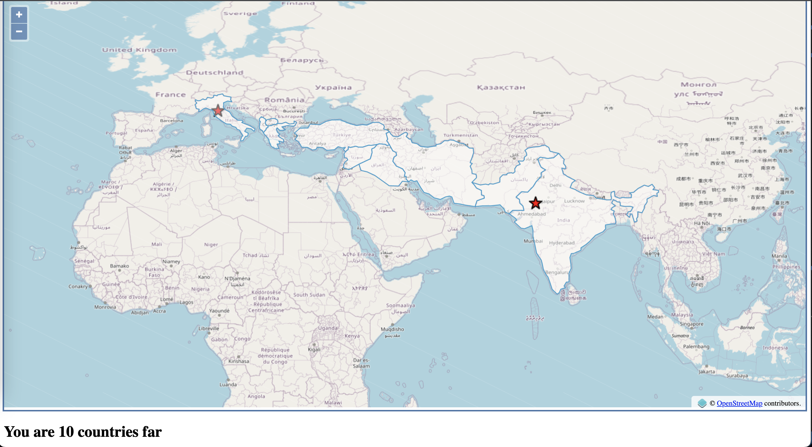

# 📍 Far Florence

Far florence allows you to click on map and see how far are you from florence. click on any countries to see how far it is from florence, Italy.

[](app.png "far")

## ⚙️ Setting up project
Create a python environement using `conda` or `virtualenv` ,etc. and then load all dependencies using following command
```
pip install -r requirements.txt
```
once done, you can start the project using 
```
python manage.py runserver
```

If above commands are not working for you, please check official documentation about GeoDjango setup [here](https://docs.djangoproject.com/en/4.0/ref/contrib/gis/install/ "here") 

at this point you will see a map with `florence` as center and you can also click on map but API will not work because we don't have contries data.

I have already added the countries data to the folder named `data` inside `mainapp` and to code to load this data is in `load.py` to run this code and load data, please use following commands

```
python manage.py shell
```

which will open shell script and then use following command

```
from mainapp import load 

load.run()
```

this will load the dataset.

## 🏃🏻 Playing with the application 
Once the setup is succesfully completed, you can go to the map and start clicking on location to see how many countries are there between clicked location and florence.

To understand more about how it is working, head over to `mainapp/views.py` and checkout function `howfar` .


